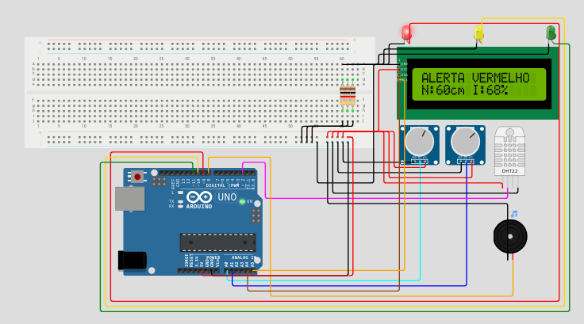

# GS - Edge
# Problema
Identificamos que a varios lugares de risco que não existe um sistema de alerta para enchentes. A falta dessas ferramentas significa que os moradores não têm conhecimento prévio das inundações, fazendo que em acidentes devastadores. As consequências são trágicas: além da perda de vidas, há um rastro de feridos, desalojados e a destruição de residências.

# Proposta
Com o uso do Arduino, nos desenvolvemos um projeto que utiliza o DHT para medir a umidade do ar. Entendemos que, a mais sinais do que so a umidade para uma enchente e que um outro sinal seria a intensidade da chuva. E por isso, a combinação desses dois dados nos permite identificar rapidamente o risco de uma enchente e usando um buzzer nos iriamos alertar a população da enchente rapidamente.

## Projeto feito usando wokwi

# Rodando o projeto no Wokwi
Para rodar o projeto voce precisara usar o site **Wokwi** seguindo os passos abaixo:
1. copie e cole os arquivos sketch.ino e diagram.json para seus respectivos arquivos para o **wokwi**
2. instale as seguintes depedencias na pagina de dependencias:
    - DHT sensor library
    - U8g2
    - LiquidCrystal I2C
3. aperte no botão **Start simulation** e teste ele a vontade!!!! 

# Links
- link do repositorio: https://github.com/Global-Solution-1-semestre/computer-edge-gs
- link do projeto: https://wokwi.com/projects/432387377511530497
- link do video: https://youtu.be/FoPlpJZIB9M
